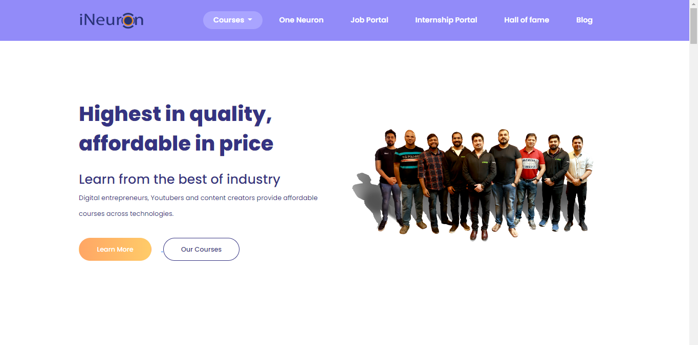
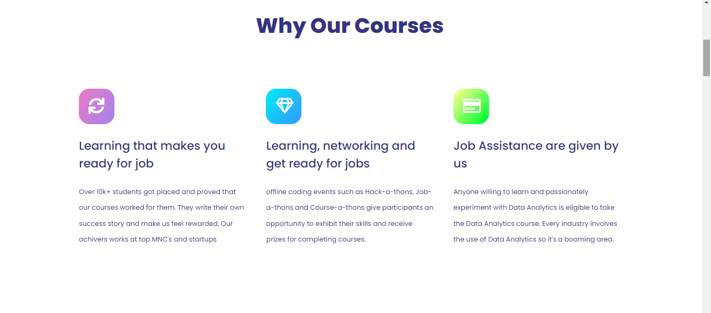
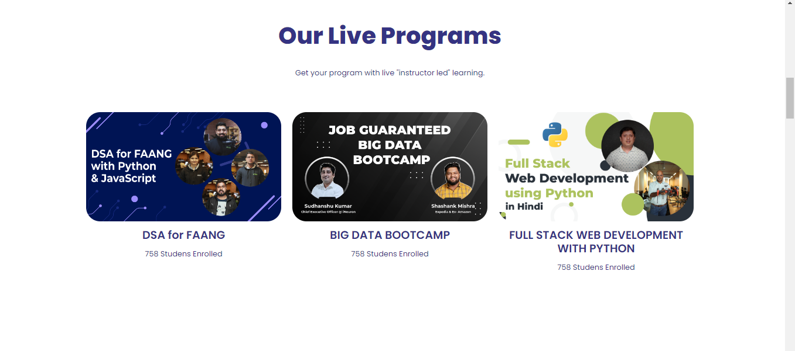
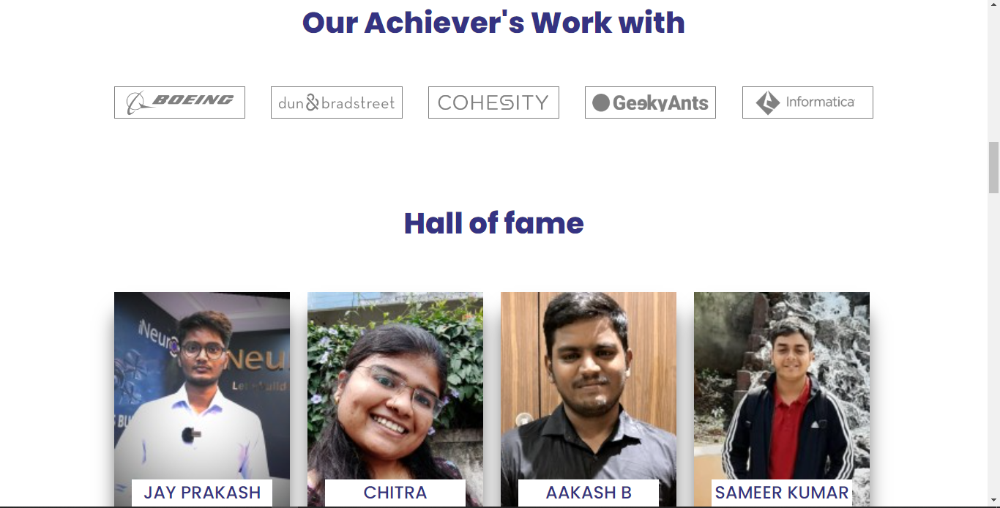

# Ineuron Home page 

- This project is a part of ineuron full stack javascript bootcamp hackathon hosted by [Findcode.io](https://www.findcoder.io/).

- In this project i use HTML, CSS, BOOTSTARP as a main tech stack.

The main reason i used bootstrap because of the nobile responsive, i hope you will love it.

# Screen-shot 

# Tech-stack

- HTML

- CSS

- BOOTSTRAP

# Disclaimer 

For best experience use 1500px as your display size.

# Author
Niranjan Rai

[Follow me on Instagram](https://www.instagram.com/me.niranjan_rai/)

